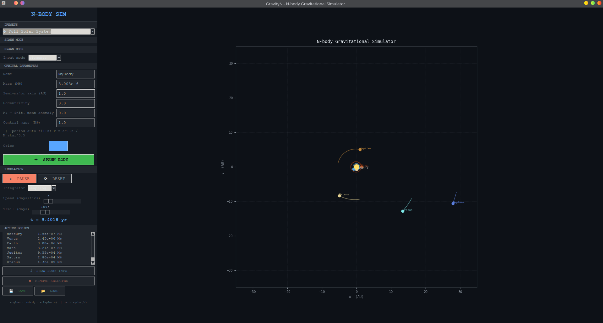

# GravityN — N-body Gravitational Simulator

GravityN is a real-time gravitational N-body simulator with a C physics
engine and a Python GUI. Every body in the simulation exerts a gravitational
force on every other body — orbits are not fixed ellipses, they emerge from
(and are continuously perturbed by) the full coupled equations of motion.

The project evolved from an earlier
[Keplerian Orbit Simulator](https://github.com/dM4XW3LL/Keplerian-Orbital-Simulator),
which modelled a single planet on a fixed analytic orbit around a star.
GravityN generalises that to a true N-body system while keeping the same
architectural philosophy: a small, fast, well-documented C core driving a
Python/Tkinter GUI through `ctypes`.




## Features

- **N-body gravity** — every body attracts every other body; no central-mass
  approximation.
- **Two integrators**:
  - **Leapfrog** (Störmer–Verlet, default) — symplectic, conserves energy
    over long runs.
  - **RK4** — fourth-order accurate, useful for short high-precision runs or
    cross-checking leapfrog.
- **Two ways to spawn a body**:
  - **Orbital elements** — semi-major axis, eccentricity, initial mean
    anomaly, and central mass, converted to a Cartesian state via the same
    Newton–Raphson Kepler solver as the original project.
  - **Cartesian state** — direct `(x, y, vx, vy)` for arbitrary
    configurations (binary stars, flybys, custom systems).
- **Solar System presets** — one-click spawn for any of the eight planets
  with real masses and orbital elements, or the entire Solar System at once.
- **Live diagnostics** — for the selected body: position, velocity, kinetic
  energy, and distance to every other body. For the system as a whole: total
  energy (with a colour-coded conservation drift indicator), total momentum,
  and barycentre position.
- **Interactive controls** — play/pause, reset, integrator selector, time
  step (days per tick), and trail length, all adjustable while running.
- **Save / load** — export and re-import a system configuration as JSON.


## Project structure

```
GravityN/
├── Makefile
├── README.md
├── nbody.so / nbody.dll / nbody.dylib   (built, not tracked in git)
├── assets/                              screenshots, icons, etc.
├── docs/                                generated documentation (Doxygen)
├── src/
│   ├── core/                            C physics engine
│   │   ├── kepler.c / kepler.h          Kepler's equation, orbital elements
│   │   └── nbody.c  / nbody.h           N-body integrators & diagnostics
│   └── gui/                             Python GUI (Tkinter + matplotlib)
│       ├── nbody_engine.py              ctypes bridge to the C library
│       ├── body.py                      Body data model & solar system presets
│       └── nbodysim.py                  GUI application (entry point)
└── tests/
    ├── test_nbody.c                     C validation suite
    └── README.md                        how to run & interpret the tests
```


## Requirements

- **C compiler** — GCC or Clang supporting C99 (for the engine).
- **Python 3.10+**
- **matplotlib** (`pip install matplotlib`)
- **Tkinter** — bundled with most Python installations. On some Linux
  distributions it must be installed separately:
  ```sh
  sudo apt install python3-tk
  ```

On Windows, run the commands below from an MSYS2, Git Bash, or WSL shell so
that `make`, `PYTHONPATH=...`, and `rm` work as expected.


## Building and running

The simplest way to build and run everything is via the included `Makefile`:

```sh
make          # build the shared physics library (nbody.so / .dll / .dylib)
make test     # build and run the C validation suite
make run      # build the library (if needed) and launch the GUI
make clean    # remove all build artifacts
```

Run `make help` to see all available targets.

### Manual build (without `make`)

If you prefer to invoke the compiler directly:

```sh
# 1. Build the shared library
gcc -O3 -fPIC -shared -o nbody.so src/core/nbody.c src/core/kepler.c -lm
#   (Windows: gcc -O3 -fPIC -shared -o nbody.dll src/core/nbody.c src/core/kepler.c)

# 2. Build and run the C test suite
gcc -O2 -o tests/test_nbody tests/test_nbody.c src/core/nbody.c src/core/kepler.c -lm
./tests/test_nbody

# 3. Run the GUI
PYTHONPATH=src/gui python3 src/gui/nbodysim.py
```

The GUI's library loader (`nbody_engine.load_nbody_lib`) searches, in order,
the `src/gui/` directory, the project root, and the current working
directory — so building `nbody.so` at the project root (as above) is the
expected location.


## Usage

1. **Spawn the Sun** — the Sun is added automatically as a 1 M☉ body at
   the origin when the application starts.
2. **Add planets** — either:
   - choose a preset from the **PRESETS** dropdown (a single planet, or
     **⊙ Full Solar System** for all eight at once), or
   - select an **input mode** (`elements` or `cartesian`), fill in the
     parameters, pick a colour, and click **SPAWN BODY**.
3. **Run the simulation** — press **▶ PLAY**. Adjust the **Speed**
   (simulated days per animation frame) and **Trail** length sliders while
   it runs.
4. **Inspect a body** — click it in the **ACTIVE BODIES** list, then click
   **ℹ SHOW BODY INFO** to open the info panel. It shows live position,
   velocity, kinetic energy, and distances to every other body, plus
   system-wide total energy, momentum, and barycentre.
5. **Switch integrators** — use the **Integrator** dropdown to compare
   **Leapfrog** (default) against **RK4**. Watch the **Energy drift** field
   in the info panel: leapfrog should stay green (drift < 10⁻⁵) indefinitely,
   while RK4 will slowly drift as it is not symplectic.
6. **Save / load** — use **💾 SAVE** and **📂 LOAD** to export or import a
   system configuration as JSON.


## Physics background

All quantities use a **solar unit system**, identical across `kepler.c` and
`nbody.c`:

| Quantity | Unit              |
|----------|-------------------|
| Length   | Astronomical Unit (AU) |
| Time     | Julian year (yr)  |
| Mass     | Solar mass (M☉)   |

In these units, Newton's gravitational constant is exactly
$G = 4\pi^2 \approx 39.478$ AU³ yr⁻² M☉⁻¹.

### Equations of motion

The acceleration on body $i$ due to all other bodies is:

$$
\mathbf{a}_i = G \sum_{j \neq i} m_j
    \frac{\mathbf{r}_j - \mathbf{r}_i}
         {\left(|\mathbf{r}_j - \mathbf{r}_i|^2 + \varepsilon^2\right)^{3/2}}
$$

where $\varepsilon$ is a small softening length that prevents the force from
diverging during close approaches.

### Integrators

- **Leapfrog (velocity-Verlet)** — a *symplectic* integrator: it conserves a
  modified Hamiltonian exactly, so total energy oscillates around a constant
  rather than drifting over long runs. This is the default and recommended
  choice for orbital mechanics.
- **RK4** — fourth-order accurate per step, but *not* symplectic. Energy
  drifts slowly over long integrations. Useful for short, high-precision
  runs or for validating the leapfrog results.

### Conservation diagnostics

The C engine exposes total energy, total momentum, and the system
barycentre (`nbody_total_energy`, `nbody_total_momentum`,
`nbody_barycentre`). The GUI uses these to show a live energy-drift
indicator — the single most useful sanity check for whether a chosen time
step is small enough for a given configuration.


## Testing

The C engine has a validation suite covering orbit closure, energy
conservation, momentum conservation, integrator agreement, and the
orbital-elements-to-state conversion. See [`tests/README.md`](tests/README.md)
for details on what each test checks and how to interpret the results.

```sh
make test
```


## Roadmap

Possible directions for future work:

- Adaptive time stepping for close encounters.
- Collision detection / merging.
- Hierarchical systems (e.g. moons orbiting planets).
- Barycentric reference-frame display toggle.
- A Barnes–Hut tree (O(N log N)) for larger N.
- 3D simulation and visualisation.


## Acknowledgements

This project builds directly on the
[Keplerian Orbital Simulator](https://github.com/dM4XW3LL/Keplerian-Orbital-Simulator),
reusing its Kepler's-equation solver (`kepler.c` / `kepler.h`) as the
initial-condition layer for the N-body engine.


## License

MIT License

Copyright (c) 2026 Diogo Pereira Gomes

Permission is hereby granted, free of charge, to any person obtaining a copy
of this software and associated documentation files (the "Software"), to deal
in the Software without restriction, including without limitation the rights
to use, copy, modify, merge, publish, distribute, sublicense, and/or sell
copies of the Software, and to permit persons to whom the Software is
furnished to do so, subject to the following conditions:

The above copyright notice and this permission notice shall be included in all
copies or substantial portions of the Software.

THE SOFTWARE IS PROVIDED "AS IS", WITHOUT WARRANTY OF ANY KIND, EXPRESS OR
IMPLIED, INCLUDING BUT NOT LIMITED TO THE WARRANTIES OF MERCHANTABILITY,
FITNESS FOR A PARTICULAR PURPOSE AND NONINFRINGEMENT. IN NO EVENT SHALL THE
AUTHORS OR COPYRIGHT HOLDERS BE LIABLE FOR ANY CLAIM, DAMAGES OR OTHER
LIABILITY, WHETHER IN AN ACTION OF CONTRACT, TORT OR OTHERWISE, ARISING FROM,
OUT OF OR IN CONNECTION WITH THE SOFTWARE OR THE USE OR OTHER DEALINGS IN THE
SOFTWARE.